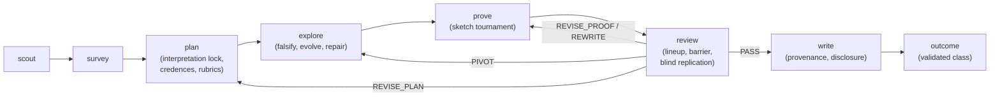
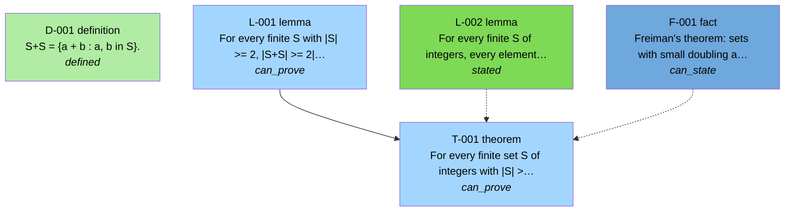

# Neugier

**Neugier** (*noy-geer*, German for *curiosity*) is a curiosity-driven, adversarially refereed **mathematical research harness**
that runs on Claude Code. It is not a problem solver. The unit of work is a *campaign*: a portfolio of targets with budgets, kill
criteria and pivots that ends in an honest LaTeX paper whose every theorem is backed by a claim ledger, a refereed proof, and a
machine-generated provenance appendix.

**Tagline:** *Curiosity, refereed.*

Neugier는 Claude Code 위에서 동작하는 **논문급 수학 연구 하네스**입니다. 문제 풀이기가 아니라 연구 캠페인을 수행합니다:
노다지 주제 발굴 → 검증된 발췌 기반 문헌 조사 → 해석 고정 계획 → 반증 우선 탐색 → 스케치 토너먼트 증명 →
**강제된 정보 차단 아래의 적대적 심사(심사자도 심사됨)** → 원장이 허용하는 주장만 담은 LaTeX 논문 → 검증된 결과 등급.

---

## What it is, in one paragraph

Every mathematical statement enters the **claim ledger** as an idea or a conjecture and can only be promoted by evidence:
verified literature excerpts, exact computations, falsification reports, proof artifacts that pass a linter, and referee verdicts
from fresh-context agents that never see the prover's reasoning. The paper compiler refuses to typeset a theorem the ledger has
not refereed. Referees are themselves refereed: skeptics review a lineup of the real proof mixed with mutants carrying planted
flaws, and a skeptic whose recall on the planted flaws is too low does not get a vote. Every target, route and proof attempt
carries a pre-registered credence that is scored afterwards, so the harness knows which of its roles are overconfident. And
agents work from their own questions: an information-gain-ranked question ledger, predictions before every experiment, a
surprise log, a detour budget, and a metered channel to the human.

## Seven signature features

### F1 Curiosity engine
Agents start from `questions.md`, not from the plan. Each question has an expectation, a credence, a stake and a cheapest test;
`harness questions next` ranks open questions by expected information gain `uncertainty × stake / cost` (uncertainty from the
credence when one is recorded) and warns when the role that raised a question has a poor calibration record. Predictions are
written before experiments and recorded as pairs; a 3/3 surprise without a follow-up prints a re-planning advisory. Each phase
carries a 30 % detour budget that any agent may spend without asking. Open questions outlive the campaign in
`library/questions.jsonl` and are a goldmine source for the next scout.

*Enforced by:* the explore gate (a recorded prediction/observation pair), the prove gate (no open prover questions), the plan
gate (≥ 3 questions with expectations), `questions budget`, and the *Questions and surprises* appendix generated into every paper.

```text
$ python -m harness questions next --campaign sidon-plateau
1. Q-003 [gain 2.40] Why does the greedy Sidon construction plateau near density 0.29 for N ≤ 2000?
   expectation: density decays like c/sqrt(N)   credence: 0.30   cheapest: seed.py N=100..5000 (15 min)
detour budget (explore): 48 of 108 minutes used
```

### F2 Evidence-gated ledger → paper compiler
`ledger add` creates only `idea`/`conjectured` claims; `promote` checks the evidence for each step of
`conjectured → numerically-supported → proof-drafted → referee-passed → formalized`. The paper linter binds every theorem-like
environment to a claim id and rejects anything not `referee-passed`; a referee-passed claim whose dependencies are not all
proved is only allowed as a `conditional` theorem, because `fully_proved` is *computed* from the dependency graph, never
declared. The outcome class (`autonomous-new-result | partial | rediscovery | literature-find | negative`) is validated against
the ledger and the novelty memo before the campaign may finish.

```text
$ python -m harness paper check --campaign demo --strict
E_CLAIM_NOT_FULLY_PROVED main.tex:212 theorem bound to T-001: dependency L-002 is 'stated' — use the conditional environment
```

### F3 Enforced information barrier with review provenance
Referees run in fresh contexts and receive only `statement.md`, the artifact (or the lineup) and the marking scheme. The barrier
is data plus a hook: `reviews/roundN/barrier.json` lists what each role may read; `hooks/barrier.py` checks every Read, Glob,
Grep, Bash and Write of every referee subagent, logs it to `access.log`, and denies the rest (including shell commands that
mention plan or ideas files, git history, transcripts, and diff tools). The replicator must `commit-blind` its re-derived values
before the barrier opens the proof. `harness review check` fails a round with an unwaived denial, a missing hook trail, or a
judge block that leaves a critical error unaddressed. The paper's provenance table states, per theorem, how many skeptic passes it
received, the lineup reliability, whether it was replicated, and whether a human attested it.

```text
{"ts":"…","role":"skeptic","agent_id":"SK-3f9a1c","tool":"Read","decision":"deny","target":"plan.md","reason":"deny:deny_always"}
```

### F4 Literature with receipts
No literature claim without a verbatim excerpt that provably occurs in the cached source text (exact match, then normalized,
then a chunked fallback for PDF hyphenation). `ledger add --status known-in-literature` refuses unverified excerpts; `<cite>`
tags in proofs bind to the excerpt hash; `lit cite-walk` performs forward/backward citation walks; the novelty checker must
re-search the *final statement with its own numbers* and record the artifact hash it classified.

```text
$ python -m harness ledger add --campaign demo --kind fact --status known-in-literature --source-id arxiv:2411.09158 --excerpt "…" --locator "§3.5"
error: excerpt not found in cached source (campaigns/demo/cache/arxiv_2411.09158.txt); use `harness lit excerpt` and copy verbatim
```

### F5 Falsification-first computation
Every conjecture and every lemma is attacked by exact-arithmetic counterexample search before proof effort. Evolutionary
program search runs without an API key (cheap subagents propose mutations; the harness rejects near-duplicates, runs cascade
evaluation, collects meta-recommendations, checkpoints, and mines elites for structure). Scorers and verifiers are hashed and
frozen; a hook denies edits during explore/prove/review. Refuted conjectures enter a repair loop: counterexamples with feature
vectors, a regression set, and three repair operators; a child must pass a truth test and a significance test (bounds need a
positive touch number).

### F6 Referees are refereed
Each review round builds a **lineup**: the real proof, mutants with one deterministic planted flaw each (dropped hypothesis
check, swapped quantifier, perturbed constant, circular step, dropped edge case, "clearly"-ification…), and a control proof of a
different statement, all with benign reformatting so items cannot be diffed. Skeptics judge every item; their reliability is
recall on the planted flaws penalized by false alarms on the control; an inadmissible skeptic is respawned. Promotion requires
`k` distinct admissible skeptics all passing (k from the claim's stakes), and pre-registered marking schemes with technique
pitfalls tell skeptics what a correct proof must establish.

### F7 Calibrated curiosity
Strategists pre-register `p_true`/`p_budget` on targets and routes (with a three-persona panel), provers pre-register `p_pass`
before each round; `ledger calibration` computes Brier scores per role once claims resolve and appends them to
`library/calibration.jsonl`. Human attention is budgeted: at most three escalations per campaign, each a concrete mathematical
question with what it would change and our best guess, written to `ASK-HUMAN.md` while the campaign keeps working; the human
answers in `HUMAN.md`, a file agents may read but never edit.

## How a campaign runs



Ledger ladder: `idea → conjectured → numerically-supported → proof-drafted → referee-passed → formalized`, or `refuted`,
`known-in-literature`, `dead`. Each claim carries **stakes** 0/1/2 that fix the review regime (skeptic passes, decoys, replicator,
citation hops, final-statement re-check, human attestation). `formalized` is reserved: the Lean 4 lane is not shipped.

### Blueprint
`harness ledger graph --format mermaid` renders the ledger as a leanblueprint-style graph. This one comes from the planted test
fixture (`tests/fixtures/planted/`), which deliberately contains a circular lemma, a false lemma, an unused hypothesis and an
unverified citation — so nothing in it is `fully_proved`:



## Precedents

Neugier borrows deliberately. The mechanisms below were taken from sources whose text was fetched and quoted during design;
the quotes and the "what is ours" assessment are in [`docs/research/borrowed-mechanisms.md`](docs/research/borrowed-mechanisms.md).

| Mechanism | Precedent |
|---|---|
| k-of-k unanimous skeptic passes, fresh critics, typed defect classes | IMO-grade verifier (arXiv 2507.15855), AIM (2505.22451), ProofCouncil (2607.09474) |
| Pre-registered marking schemes | ProofGrader (2510.13888) |
| Planted-flaw lineups, all-correct control | Agentic review benchmark (2606.19749), ProcessBench (2412.06559) |
| Credences + Brier calibration, persona panel | claim-prediction-market |
| Truth/significance tests, touch number, regression set | The Optimist (2411.09158) |
| Stakes tiers, unverified marker, novelty classes | erdosproblems wiki |
| Final-statement re-search | Bubeck et al. (2511.16072) |
| Coverage by type, provenance table, sampled audit | Kosmos (2511.02824) |
| Blueprint statuses and colors | leanblueprint |
| Sketch ratings (plausibility/clarity/novelty), Elo 1200, P-UCB, debates | DeepMind formal search (2605.22763), AI co-scientist (2502.18864) |
| Human escalation, human-owned policy file, never stop | DeepMind co-mathematician (2605.06651), autoresearch |
| Cascade evaluation, artifacts, meta recommendations, novelty rejection | OpenEvolve, ShinkaEvolve |
| Performative-compliance checks | flonat-research hooks |
| AI-involvement disclosure | Agents4Science 2025 |
| Saved workflows, worktree isolation, SubagentStop gate, eval suites | Claude Code docs |

Not claimed: referee diversity across model families (every agent is the same family; independence comes from fresh contexts,
the barrier, decoys and computation), Lean formalization (deferred), network sandboxing of experiments (timeouts only).

## Quick start

### 한국어
```powershell
git clone https://github.com/zi-wa/Neugier.git; cd Neugier
.\scripts\bootstrap.ps1                     # .venv, bin/tectonic, .cache — 전부 프로젝트 안. 전역 설치 없음.
.venv\Scripts\python.exe -m harness doctor   # 환경 점검(훅 등록, tectonic, UTF-8, 엔진 접근)
claude --plugin-dir .                        # 또는 /plugin marketplace add zi-wa/Neugier 후 /plugin install neugier@neugier-marketplace
/research auto                               # 스카우트가 노다지 주제를 고르고 캠페인을 끝까지 수행
/status                                      # 대시보드: 단계, 미충족 기준, 예산, 질문, 캘리브레이션, 최근 심사 라운드
```
얻는 것: `campaigns/<slug>/paper/main.pdf`(원장이 허용한 정리만), `ledger.json`(모든 주장·증거·신뢰도), `reviews/roundN/`
(심사 보고서, `barrier.json`, `access.log`, `lineup_score.*.json`, `coverage-*.json`), 재현·출처·공개·질문 부록, `library/`(캠페인 간 기억).
사용자 보고는 한국어, 하네스 내부 산출물과 논문은 영어입니다.

### English
```powershell
git clone https://github.com/zi-wa/Neugier.git; cd Neugier
.\scripts\bootstrap.ps1                     # Linux/macOS: scripts/bootstrap.sh
.venv\Scripts\python.exe -m harness doctor
claude --plugin-dir .                        # commands are /research, /scout, /survey, /plan-research, /explore, /prove, /review, /paper, /status
/research "sum-free subsets of finite abelian groups"
```
Nightly, unattended: `python -m harness headless --slug <slug> --max-iterations 20` (or `scripts/run_campaign.ps1`).
No API key and no GPU are needed; everything runs through your Claude Code session and the project-local `.venv`.

## Enforcement matrix

Neugier's brand is saying exactly what is enforced.

| Enforced by code or hooks | Prompt-level only | Non-goals |
|---|---|---|
| venv-only Python, no global installs (`enforce_venv` hook) | model routing (R1) | model-family diversity of referees |
| phase gates + Stop hook; SubagentStop deliverable gate | how well the curiosity budget is spent | Lean 4 formalization (deferred; schema only) |
| referee barrier with access log (a tripwire for careless access, not a sandbox) | judge reasoning quality | network sandboxing of experiments |
| replicator blind commit before artifact access | novelty search breadth | official `claude plugin eval` (early access; use `harness evals run`) |
| review round cap; stakes-derived regime; k-of-k admissible skeptics | rubric quality (written before proofs) | |
| lineup reliability gate; sealed lineup + commitment hash | credence honesty (made visible by panel spread and Brier) | |
| judge block consistency (upheld/rebutted/moot, quoted rebuttals) | lessons quality | |
| final-statement re-check + artifact hash at stakes 2 | | |
| verified excerpts; proof linter; rubric freeze; frozen scorers/statement/HUMAN.md | | |
| computed `fully_proved`; `conditional`/`knownresult`/`\unverified` rules; audit `E_AUDIT_REFUTED` | | |
| repair children need truth + significance evidence | | |
| human-only `campaign attest`; escalation budget | | |
| budgets and overrun notes; outcome class validation; `campaign finish` requires lessons | | |

Note: when the plugin is loaded with `claude --plugin-dir .` inside this repo, hooks are registered twice (plugin and project);
the access log deduplicates, but the Stop gate counts attempts twice.

**Measurements.** Recall, Brier scores, coverage percentages and eval deltas are quoted only from files the harness generated
(`lineup_score.*.json`, `calibration.json`, `coverage-*.json`, `evals/results/**/aggregate.json`). None have been measured on a
real campaign yet; this README therefore contains no performance numbers.

## CLI cheatsheet (`PY = .venv/Scripts/python.exe`)

| Area | Commands |
|---|---|
| campaign | `campaign create|activate|phase|check|status|budget --set|lock-statement|freeze|targets|suggest-stakes|attest|ack-human|outcome|finish` |
| ledger | `ledger add|evidence|promote|update --stakes|reverify|credence|calibration [--final]|repair|attest|graph --format mermaid|assertable|md|check` |
| review | `review open|lineup build\|unseal\|status\|verify|score-lineup|commit-blind|waive|regime|check|close|status` |
| proofs | `proof check|coverage`, `prove elo|collect` |
| curiosity | `questions list|next|surprise|detour|answer|park|drop|budget|export|for-human|human-answers|advisories`, `ideas list|dedup|graph` |
| literature | `lit search|get|fetch|cache-path|verify-excerpt|excerpt|cite-walk|resolve|checkbib` |
| computation | `falsify run [--regression]|template|identity|hash`, `evolve init|next|score|status|checkpoint|resume|mine|meta-request|template` |
| paper | `paper repro|build|check [--strict]|audit sample\|check|init|all` |
| memory | `library add-fact|add-rejected|add-result|find-lemma|lessons|moves-stats|list {rejected,results,facts,questions,calibration,lemmas,lessons,moves}` |
| ops | `doctor [--offline]`, `headless`, `evals list|run` |

## Layout

```
agents/           13 agent prompts (scout, librarian, fetcher, strategist, experimentalist, prover, skeptic, falsifier,
                  novelty-checker, replicator, judge, writer, copyeditor); referees carry the barrier + subagent-gate hooks
skills/           /research /scout /survey /plan-research /explore /prove /review /paper /status + references/
hooks/            enforce_venv, barrier, guard_frozen, gate_stop, gate_subagent, inject_context (stdlib only)
harness/          Python runtime: ledger/, lit/, verify/, search/, proof/, prove/, review/, paper/, library/, text/, questions, ideas, campaign, doctor, headless, evals
.claude/workflows/ neugier-review.js, neugier-prove.js (opt-in deterministic orchestration)
evals/            plugin eval cases + in-house runner support
tests/            offline test suite (+5 live tests marked `live`); tests/fixtures/planted/ is a campaign with known flaws
docs/research/    design plan, harness survey, borrowed mechanisms (historical record)
campaigns/ library/ bin/ .cache/ .venv/   created locally; never committed
```

## Development

```powershell
.venv\Scripts\python.exe -m pytest -m "not live"      # offline suite
.venv\Scripts\python.exe -m pytest -m live            # network tests (arXiv, OpenAlex, OEIS)
.venv\Scripts\python.exe -m harness doctor
.venv\Scripts\python.exe -m harness evals run --case review-planted-circular --runs 1   # agent-level eval (costs tokens)
```

Conventions: every file I/O uses `encoding="utf-8"` (the host is cp949); hooks use the standard library only; the `harness`
import path is stable; the Python distribution is `neugier-harness` with console script `neugier`.

## Distribution

```text
/plugin marketplace add zi-wa/Neugier
/plugin install neugier@neugier-marketplace
```
Installed as a plugin the commands are namespaced (`/neugier:research`); loaded with `--plugin-dir .` or via the project's
`.claude/` junctions they are bare (`/research`).

## Legal

Neugier is an independent project that runs on Claude Code. It is not affiliated with or endorsed by Anthropic; the names
"Claude" and "Anthropic" are not part of the product name or logo. License: MIT (see `LICENSE`).
