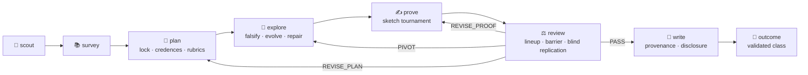
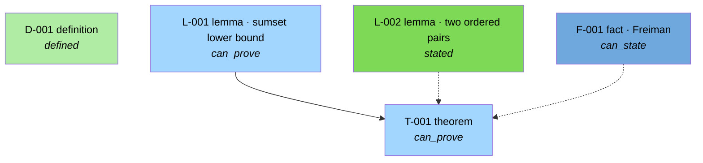

<a name="top"></a>
<div align="center">

<picture>
  <source media="(prefers-color-scheme: dark)" srcset="docs/assets/banner-dark.svg">
  
</picture>

**An autonomous mathematical *research* harness that runs on Claude Code.**

*It does not try to solve your problem. It runs a research campaign — and refuses to write down anything it has not refereed.*

<p align="center">
  <a href="LICENSE"></a>
  <a href="pyproject.toml"></a>
  <a href="https://github.com/zi-wa/Neugier/actions/workflows/tests.yml"></a>
  
  
  
  
</p>

[**Quick start**](#quick-start) • [**How a campaign runs**](#how-a-campaign-runs) • [**See it in action**](#see-it-in-action) • [**What is actually enforced**](#what-is-actually-enforced) • [**Precedents**](#precedents)

**English** | [**한국어**](README_ko.md)

</div>

---

Every mathematical statement enters a **claim ledger** as an idea or a conjecture, and only evidence promotes it: verified
literature excerpts, exact computations, counterexample searches, proof artifacts that pass a linter, and verdicts from
fresh-context referees who never see the prover's reasoning. The paper compiler refuses to typeset a theorem the ledger has
not refereed. The referees are themselves refereed — skeptics review a lineup of the real proof mixed with mutants carrying
planted flaws, and a skeptic who misses the planted flaws does not get a vote.

**Neugier** is German for *curiosity* (*noy-geer*, literally "greed for the new"). Agents work from their own questions, ranked
by expected information gain, with a detour budget they may spend without asking.

> [!NOTE]
> **What this is not.** Not a problem solver, not a benchmark runner, and not a proof assistant. Neugier orchestrates a
> *campaign* and is judged by the honesty of its artifact, not by a score. Lean 4 formalization is deferred: `formalized`
> exists in the schema, nothing ships behind it. No full campaign has been run end-to-end yet, so this page reports no
> performance numbers — only what the code enforces.

## 📣 Updates

- **2026-09-04 — v0.2.0.** Round 2 shipped: decoy-lineup review, stakes-derived review regimes, pre-registered credences with
  Brier calibration, counterexample-guided conjecture repair, verification coverage + blueprint graph, metered human office
  hours, sketch-first Elo tournaments, evolutionary-search upgrades. 353 offline tests.
- **2026-09-03 — v0.1.0.** First working harness: 13 agents, 9 skills, claim ledger, falsification-first exploration,
  adversarial review, tectonic paper build.

## Why

In a published audit of an AI system on open Erdős problems, 200 expert-checked answers that the system had *verified itself*
came back **68.5 % flawed**, and 50 of the "correct" ones had solved a misread version of the problem
([arXiv:2601.22401](https://arxiv.org/abs/2601.22401)). Separately, an AI's "solutions" to ten Erdős problems turned out to be
literature the model had rediscovered. Those two failures — unchecked self-verification and unchecked novelty — are what this
harness is built against.

| The usual failure | What Neugier does about it |
|---|---|
| The model verifies its own proof | Referees run in fresh contexts behind a hook-enforced information barrier; every file access is logged |
| The reviewer is a rubber stamp | Skeptics are scored on a lineup of decoys with planted flaws; a low-recall skeptic's verdict is inadmissible |
| A "theorem" rests on an unproved lemma | `fully_proved` is computed from the dependency graph; anything less is typeset as a *conditional* theorem |
| Citations from memory | Every excerpt must be found verbatim in a source fetched into the campaign cache, or it does not count |
| Numbers invented in prose | Every number comes from a script and lands in `results.json`; the paper references keys, and a sampled audit labels sentences |
| "We already knew this" | A novelty gate before proof effort and a second one that re-searches the *final statement with its own numbers* |
| Confident nonsense | Every target, route and proof attempt carries a pre-registered credence that is scored with Brier afterwards |
| The agent quietly gives up | Phase gates refuse to end a phase whose exit criteria are unmet; the campaign ends in a validated outcome class |

## Seven signature features

**1 · Curiosity engine.** `questions.md` is a real ledger: each question has an expectation, a credence, a stake and a cheapest
test. `harness questions next` ranks by expected information gain and warns when the role that raised a question is poorly
calibrated. Predictions are written before experiments; surprises are logged; each phase carries a 30 % detour budget. Open
questions outlive the campaign and become goldmine sources for the next one.

**2 · Evidence-gated ledger → paper compiler.** `idea → conjectured → numerically-supported → proof-drafted → referee-passed`.
`ledger add` cannot create anything above `conjectured`. The LaTeX linter binds every theorem to a claim id and rejects what
the ledger has not refereed.

**3 · Enforced information barrier.** `reviews/roundN/barrier.json` says what each referee may read; `hooks/barrier.py` checks
every Read, Glob, Grep, Bash and Write of every referee subagent and writes `access.log`. The replicator must commit its
blind re-derivation *before* the barrier opens the proof. A round with an unwaived denial fails.

**4 · Literature with receipts.** No literature claim without a verbatim excerpt that provably occurs in the cached source
(exact → normalized → chunked fallback for PDF hyphenation). `<cite>` tags in proofs bind to the excerpt hash.

**5 · Falsification-first computation.** Counterexample search before proof effort, on the theorem *and* every lemma. Exact
arithmetic. Evolutionary program search with a frozen, hashed scorer — no API key, cheap subagents propose the mutations.
Refuted conjectures enter a repair loop with truth and significance tests.

**6 · Referees are refereed.** Each round builds a lineup: the real proof, mutants with one planted flaw each, and a control
proof of a different statement, all reformatted so items cannot be diffed. Reliability = recall on planted flaws, penalized by
false alarms. Promotion needs `k` distinct admissible skeptics, all passing.

**7 · Calibrated curiosity.** Strategists pre-register `p_true`/`p_budget` with a three-persona panel; provers pre-register
`p_pass`. Brier scores per role accumulate across campaigns. Human attention is budgeted too: three escalations per campaign,
each a concrete question, written to `ASK-HUMAN.md` while the campaign keeps working.

## How a campaign runs



Every claim carries **stakes** 0/1/2, and the review regime follows from them — how many skeptics, whether a decoy lineup and a
replicator are required, how many citation hops, whether the final statement is re-searched, whether a human must sign off:

```console
$ harness review regime --campaign demo --claim T-001
{
  "claim": "T-001",
  "regime": { "stakes": 1, "skeptic_passes": 2, "decoys": 2, "control": true,
              "replicator_required": true, "novelty_hops": 1,
              "final_statement_recheck": false, "human_attest": false }
}
```

The campaign ends in one honest, *validated* class: `autonomous-new-result`, `partial`, `rediscovery`, `literature-find`, or
`negative`. `harness campaign outcome` checks the claim you make against the ledger and the novelty memo.

## See it in action

All output below is real, produced by the test fixture `tests/fixtures/planted/` — a campaign that deliberately contains a
circular lemma, a false lemma, an unused hypothesis and a citation whose excerpt is not in the source.

<details open>
<summary><b>The proof linter finds the planted flaws before any referee is spawned</b></summary>

```console
$ harness proof check campaigns/demo/proofs/T-001.md --campaign demo
proof check: FAILED  (3 error(s), 0 warning(s))  campaigns\demo\proofs\T-001.md
  [ERROR E_PROOF_CITE] line 20 <cite claim=F-001>: claim status is 'idea', needs known-in-literature
  [ERROR E_PROOF_CITE] line 20 <cite claim=F-001> excerpt-hash 'deadbeef0000' matches no verified excerpt on that claim
  [ERROR E_PROOF_HYPOTHESIS_UNUSED] hypothesis 'S contains 0' is not accounted for in '## Self-check log'
```
</details>

<details>
<summary><b>The falsifier refutes the planted lemma with an exact counterexample</b></summary>

```console
$ harness falsify run campaigns/demo/experiments/falsify/L-002.py
{
  "conjecture": "L-002",
  "strategy": "all",
  "tested": 10,
  "counterexample": "S={0, 1, 2}: sum 2 attained by 3 ordered pairs",
  "counterexample_repr": "(0, 1, 2)",
  "seed": 0,
  "regression_set": [],
  "touch_number": null
}
```
</details>

<details>
<summary><b>Opening a review round builds the barrier and the decoy lineup</b></summary>

```console
$ harness review open --campaign demo --claim T-001 --artifact proofs/T-001.md --seed 7
{
  "deliverables": {
    "skeptic:SK-39f152": "reviews/round1/skeptic.SK-39f152.md",
    "skeptic:SK-6a3357": "reviews/round1/skeptic.SK-6a3357.md",
    "falsifier": "reviews/round1/falsifier.md",
    "novelty":   "reviews/round1/novelty.md",
    "replicator":"reviews/round1/replicator.md",
    "judge":     "reviews/round1/judge.md"
  },
  "lineup": { "dir": "reviews/round1/lineup/", "items": ["A", "B", "C", "D"] }
}
```
One of A–D is the real proof, two are mutants with a planted flaw, one is a control proof of a different statement. The
skeptics do not know which.
</details>

<details>
<summary><b>The barrier hook allows the statement, denies everything else — and logs it all</b></summary>

```console
$ python hooks/barrier.py   # PreToolUse payload: skeptic SK-39f152 tries to read ideas.md
[Neugier barrier] Read on 'ideas.md' is not permitted for skeptic:SK-39f152 (deny:ideas.md).
You see only statement.md and the artifact(s) under review; your allowlist: statement.md,
refs.bib, cache/**, ledger.json, ledger.audit.jsonl, experiments/results.json …

$ cat campaigns/demo/reviews/round1/access.log
{"role":"skeptic:SK-39f152","tool":"Read","decision":"allow","target":"statement.md","reason":"allow:statement.md"}
{"role":"skeptic:SK-39f152","tool":"Read","decision":"deny","target":"ideas.md","reason":"deny:ideas.md"}
{"role":"skeptic:SK-39f152","tool":"Bash","decision":"deny","target":"diff reviews/round1/lineup/A.md reviews/round1/lineup/B.md","reason":"deny:shell:pairwise diffs of lineup items are forbidden"}
{"role":"skeptic:SK-39f152","tool":"Read","decision":"deny","target":"reviews/round1/lineup.sealed.json","reason":"deny:reviews/**"}
```
</details>

<details>
<summary><b>The dashboard: gates, budgets, questions, human, calibration</b></summary>

```console
$ harness campaign status demo
## Phase exit criteria
1 unmet criterion/criteria to leave phase 'review':
- [ ] no referee evidence recorded (no review round found)

## Budgets
- total: 2.741 h spent / 8.0 h
- max_review_rounds: 3; curiosity_fraction: 0.3

## Questions (rule R6)
- questions: open 1; observations: 1; detours: 0
- next: Q-001 Is the bound tight only for arithmetic progressions? (gain 0.300; test: enumerate |S| <= 6 (10 min))

## Human
- escalations: 0/3 used; open: none; policy: MODIFIED
- advisory: L-001 is proof-drafted but no falsification evidence is attached
```
</details>

### The blueprint

`harness ledger graph --format mermaid` renders the ledger with [leanblueprint](https://github.com/PatrickMassot/leanblueprint)
statuses. Nothing in the planted fixture reaches `fully_proved`, and that is the point:



## What's inside

| | Count | What it is |
|---|---:|---|
| Agents | 13 | scout · librarian · fetcher · strategist · experimentalist · prover · **skeptic · falsifier · novelty-checker · replicator · judge** · writer · copyeditor |
| Skills (slash commands) | 9 | `/research` `/scout` `/survey` `/plan-research` `/explore` `/prove` `/review` `/paper` `/status` |
| Reference docs | 8 | proof standards · referee checklist · technique pitfalls · creative moves · curiosity · novelty protocol · goldmine rubric · LaTeX style |
| Hooks | 6 | `enforce_venv` · `barrier` · `guard_frozen` · `gate_stop` · `gate_subagent` · `inject_context` |
| Python runtime | 71 modules | claim ledger, literature cache, exact verifiers, evolutionary search, review machinery, paper compiler, cross-campaign memory |
| Tests | 353 offline | plus 5 live network tests and a planted-flaw fixture campaign |

The three commands that carry the design:

| Command | What it does | Contents |
|---|---|---|
| `/research` | Runs a whole campaign, phase by phase, with the curiosity loop between phases | **Agents:** all 13 · **Hooks:** Stop gate on every phase · **Output:** paper, ledger, appendices, validated outcome class |
| `/review` | One adversarial round — also usable standalone on any proof file | **Agents:** k×skeptic ∥ falsifier ∥ novelty-checker ∥ replicator → judge · **Hooks:** PreToolUse barrier, SubagentStop deliverable gate · **Output:** verdicts, `access.log`, lineup scores, coverage |
| `/prove` | Sketch-first proving: personas sketch, the falsifier attacks, raters rank, Elo picks who writes the full proof | **Agents:** prover ×n, falsifier, judge (rater mode) · **Output:** proof artifacts that pass `harness proof check` |

## Quick start

```powershell
git clone https://github.com/zi-wa/Neugier.git
cd Neugier
.\scripts\bootstrap.ps1                      # Linux/macOS: scripts/bootstrap.sh
.venv\Scripts\python.exe -m harness doctor    # environment check: hooks, tectonic, UTF-8, engines
claude --plugin-dir .
```

Then, inside Claude Code:

```text
/research auto                 # the scout picks a goldmine target and runs the whole campaign
/research "sum-free subsets of finite abelian groups"
/status                        # phase, unmet criteria, budgets, questions, calibration, last review round
```

Install it as a plugin instead of cloning:

```text
/plugin marketplace add zi-wa/Neugier
/plugin install neugier@neugier-marketplace
```

Everything lives inside the project: `.venv`, `bin/tectonic`, `.cache`. No global installs, no API key, no GPU — the harness
runs on your Claude Code session. Unattended overnight: `python -m harness headless --slug <slug> --max-iterations 20`.

**What you get:** `campaigns/<slug>/paper/main.pdf` (only ledger-sanctioned theorems), `ledger.json` (every claim, its
evidence and its credences), `reviews/roundN/` (referee reports, `barrier.json`, `access.log`, lineup scores, coverage), the
reproducibility, provenance, AI-disclosure and open-questions appendices, and `library/` — memory that carries to the next campaign.

## What is actually enforced

Saying exactly what is enforced *is* the brand. Nothing below is aspirational.

| Enforced by code or hooks | Prompt-level only | Non-goals |
|---|---|---|
| venv-only Python, no global installs | model routing | referees from different model families |
| phase gates + Stop hook; subagent deliverable gate | how well the detour budget is spent | Lean 4 formalization (deferred; schema only) |
| referee barrier + access log (a tripwire, not a sandbox) | judge reasoning quality | network sandboxing of experiments |
| replicator blind commit before artifact access | novelty search breadth | official `claude plugin eval` (early access) |
| round cap; stakes-derived regime; k-of-k admissible skeptics | marking-scheme quality | |
| lineup reliability gate; sealed lineup + commitment hash | credence honesty (visible via panel spread and Brier) | |
| judge block consistency; quoted rebuttals | | |
| final-statement re-check + artifact hash at stakes 2 | | |
| verified excerpts; proof linter; frozen scorers, statement, rubrics, `HUMAN.md` | | |
| computed `fully_proved`; conditional/knownresult/`\unverified` rules; sampled-audit errors | | |
| repair children need truth **and** significance evidence | | |
| human-only attestation; escalation budget | | |
| budgets, overrun notes, validated outcome class, lessons required to finish | | |

> **Measurements.** Recall, Brier scores, coverage and eval deltas are quoted only from files the harness generated
> (`lineup_score.*.json`, `calibration.json`, `coverage-*.json`, `evals/results/**`). None have been measured on a real
> campaign yet, so this page contains no performance numbers.

## Precedents

Neugier borrows deliberately, and records what it borrowed. Quotes, sources and an honest "what is actually ours" assessment
live in [`docs/research/borrowed-mechanisms.md`](docs/research/borrowed-mechanisms.md).

| Mechanism | Precedent |
|---|---|
| Unanimous multi-pass verification, fresh critics, typed defect classes | IMO-grade verifier ([2507.15855](https://arxiv.org/abs/2507.15855)), AIM ([2505.22451](https://arxiv.org/abs/2505.22451)), ProofCouncil |
| Pre-registered marking schemes | ProofGrader ([2510.13888](https://arxiv.org/abs/2510.13888)) |
| Planted-flaw benchmarks, all-correct controls | agentic-review benchmark, ProcessBench ([2412.06559](https://arxiv.org/abs/2412.06559)) |
| Truth / significance tests, touch numbers | The Optimist ([2411.09158](https://arxiv.org/abs/2411.09158)) |
| Final-statement re-search | Bubeck et al. ([2511.16072](https://arxiv.org/abs/2511.16072)) |
| Coverage by type, provenance, sampled accuracy audit | Kosmos ([2511.02824](https://arxiv.org/abs/2511.02824)) |
| Blueprint statuses and colors | leanblueprint |
| Sketch ratings, Elo 1200, P-UCB, debates | DeepMind formal search, AI co-scientist ([2502.18864](https://arxiv.org/abs/2502.18864)) |
| Human escalation, human-owned policy file | DeepMind co-mathematician, autoresearch |
| Cascade evaluation, meta-recommendations, novelty rejection | OpenEvolve, ShinkaEvolve |
| AI-involvement disclosure | Agents4Science 2025 |

## Under the hood

<details>
<summary><b>CLI cheatsheet</b></summary>

`PY = .venv/Scripts/python.exe` · every group is `PY -m harness <group> …`

| Group | Commands |
|---|---|
| `campaign` | `create · activate · phase · check · status · budget --set · lock-statement · freeze · targets · suggest-stakes · attest · ack-human · outcome · finish` |
| `ledger` | `add · evidence · promote · update --stakes · reverify · credence · calibration · repair · attest · graph --format mermaid · assertable · md · check` |
| `review` | `open · lineup build\|unseal\|status\|verify · score-lineup · commit-blind · waive · regime · check · close · status` |
| `proof` / `prove` | `proof check · proof coverage` · `prove elo · prove collect` |
| curiosity | `questions list\|next\|surprise\|detour\|answer\|park\|budget\|for-human\|human-answers` · `ideas list\|dedup\|graph` |
| `lit` | `search · get · fetch · cache-path · verify-excerpt · excerpt · cite-walk · resolve · checkbib` |
| computation | `falsify run [--regression] · evolve init\|next\|score\|status\|checkpoint\|resume\|mine\|meta-request` |
| `paper` | `repro · build · check [--strict] · audit sample\|check · init · all` |
| `library` | `add-fact · find-lemma · lessons · moves-stats · list {rejected,results,facts,questions,calibration,lemmas,lessons,moves}` |
| ops | `doctor [--offline] · headless · evals list\|run` |
</details>

<details>
<summary><b>Repository layout</b></summary>

```
agents/            13 agent prompts — scout, librarian, fetcher, strategist, experimentalist, prover,
                   skeptic, falsifier, novelty-checker, replicator, judge, writer, copyeditor
skills/            /research /scout /survey /plan-research /explore /prove /review /paper /status
skills/references/ proof standards, referee checklist, technique pitfalls, creative moves, curiosity,
                   novelty protocol, goldmine rubric, LaTeX style
hooks/             enforce_venv · barrier · guard_frozen · gate_stop · gate_subagent · inject_context
harness/           Python runtime (~16k lines): ledger, lit, verify, search, proof, prove, review,
                   paper, library, text, questions, ideas, campaign, doctor, headless, evals
.claude/workflows/ neugier-review.js · neugier-prove.js  (opt-in deterministic orchestration)
evals/             plugin-eval cases + the in-house runner
tests/             40 test modules; tests/fixtures/planted/ is a campaign with known flaws
docs/research/     design plan, harness survey, borrowed mechanisms
```
</details>

<details>
<summary><b>Development</b></summary>

```powershell
.venv\Scripts\python.exe -m pytest -m "not live"     # 353 offline tests
.venv\Scripts\python.exe -m pytest -m live           # 5 network tests (arXiv, OpenAlex, OEIS)
.venv\Scripts\python.exe -m harness doctor
.venv\Scripts\python.exe -m harness evals run --case review-planted-circular --runs 1
```

Conventions: every file I/O uses `encoding="utf-8"` (the host default is cp949); hooks use the standard library only; the
`harness` import path is stable; the Python distribution is `neugier-harness` with console script `neugier`.

Note: with `claude --plugin-dir .` inside this repo the hooks are registered twice (plugin *and* project). The access log
deduplicates; the Stop gate counts attempts twice.
</details>

## Citation

```bibtex
@software{neugier2026,
  title  = {Neugier: an adversarially refereed mathematical research harness},
  author = {zi-wa},
  year   = {2026},
  url    = {https://github.com/zi-wa/Neugier},
  version = {0.2.0}
}
```

## License and notices

MIT — see [`LICENSE`](LICENSE). Neugier is an independent project that runs on Claude Code; it is not affiliated with or
endorsed by Anthropic, and the names "Claude" and "Anthropic" are not part of the product name or logo.

<p align="right"><a href="#top">⬆️ back to top</a></p>
