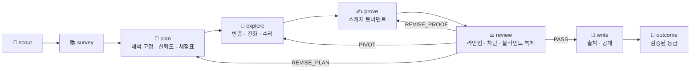
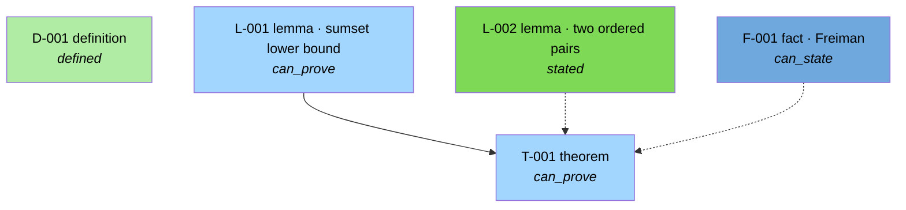

<a name="top"></a>
<div align="center">

<picture>
  <source media="(prefers-color-scheme: dark)" srcset="docs/assets/banner-dark.svg">
  
</picture>

**Claude Code 위에서 동작하는 자율 수학 *연구* 하네스.**

*문제를 대신 풀어주지 않습니다. 연구 캠페인을 수행하고, 심사를 통과하지 않은 것은 논문에 적지 않습니다.*

<p align="center">
  <a href="LICENSE"></a>
  <a href="pyproject.toml"></a>
  
  
  
  
</p>

[**빠른 시작**](#빠른-시작) • [**캠페인 진행 방식**](#캠페인-진행-방식) • [**실제 동작**](#실제-동작) • [**무엇이 강제되는가**](#무엇이-강제되는가) • [**선행 연구**](#선행-연구)

[**English**](README.md) | **한국어**

</div>

---

모든 수학적 진술은 **주장 원장(claim ledger)** 에 아이디어나 추측으로 들어오고, 오직 증거만이 그것을 승격시킵니다.
검증된 문헌 발췌, 정확한 계산, 반례 탐색, 린터를 통과한 증명 산출물, 그리고 증명자의 사고 과정을 절대 보지 못하는
새 컨텍스트 심사자들의 판정입니다. 논문 컴파일러는 원장이 심사하지 않은 정리를 조판하기를 거부합니다. 심사자 자신도
심사받습니다. 스켑틱은 진짜 증명과 결함을 심어둔 변이본이 섞인 라인업을 심사하고, 심어둔 결함을 놓친 스켑틱은
발언권을 잃습니다.

**Neugier**(노이기어)는 독일어로 *호기심*이며, 문자 그대로는 "새것에 대한 탐욕"입니다. 에이전트는 자기가 실제로 품은
질문에서 출발하고, 기대 정보이득 순으로 다음 행동을 고르며, 묻지 않고 쓸 수 있는 우회 예산을 가집니다.

> [!NOTE]
> **이것이 아닌 것.** 문제 풀이기가 아니고, 벤치마크 러너가 아니며, 증명 보조기(proof assistant)도 아닙니다. Neugier는
> *캠페인*을 지휘하며, 점수가 아니라 산출물의 정직성으로 평가받습니다. Lean 4 형식화는 다음 라운드로 미뤄져 있습니다
> (`formalized` 상태는 스키마에만 존재). 아직 실제 캠페인을 처음부터 끝까지 돌린 적이 없으므로 이 문서에는 성능 수치가
> 없습니다. 오직 코드가 강제하는 것만 적습니다.

## 업데이트

- **2026-09-04 — v0.2.0.** 라운드 2 완료: 미끼 라인업 심사, 이해관계(stakes) 기반 심사 체제, 사전 등록 신뢰도와 Brier
  캘리브레이션, 반례 유도 추측 수리, 검증 커버리지와 블루프린트 그래프, 계량된 사람 오피스 아워, 스케치 우선 Elo
  토너먼트, 진화 탐색 강화. 오프라인 테스트 353개.
- **2026-09-03 — v0.1.0.** 첫 동작 하네스: 에이전트 13개, 스킬 9개, 주장 원장, 반증 우선 탐색, 적대적 심사, tectonic 논문 빌드.

## 왜 필요한가

한 AI 시스템을 미해결 에르되시 문제에 적용한 공개 감사에서, 그 시스템이 **스스로 검증했다고 판단한** 답 200개를 전문가가
확인하니 **68.5 %가 결함**이었고, "정답" 중 50개는 문제를 잘못 읽고 다른 문제를 푼 것이었습니다
([arXiv:2601.22401](https://arxiv.org/abs/2601.22401)). 또 다른 사례에서는 AI가 "해결했다"던 에르되시 문제 열 개가
사실은 이미 문헌에 있던 결과였습니다. 검증되지 않은 자기 검증과 검증되지 않은 참신성 — 이 두 실패가 이 하네스를 만든 이유입니다.

| 흔한 실패 | Neugier가 하는 일 |
|---|---|
| 모델이 자기 증명을 자기가 검증한다 | 심사자는 훅으로 강제되는 정보 차단 뒤 새 컨텍스트에서 동작하고, 모든 파일 접근이 기록됩니다 |
| 심사가 형식적 도장 찍기가 된다 | 스켑틱은 결함을 심어둔 미끼 라인업으로 채점되고, 재현율이 낮은 스켑틱의 판정은 채택되지 않습니다 |
| 증명되지 않은 보조정리 위에 "정리"가 선다 | `fully_proved`는 의존성 그래프에서 **계산**되며, 미달이면 *조건부 정리*로만 조판됩니다 |
| 기억에 의존한 인용 | 모든 발췌는 캠페인 캐시에 받아온 원문에서 그대로 발견되어야 하며, 아니면 인정되지 않습니다 |
| 본문에서 지어낸 숫자 | 모든 숫자는 스크립트에서 나와 `results.json`에 기록되고, 논문은 키를 참조하며, 표본 감사가 문장을 라벨링합니다 |
| "그거 이미 알려진 건데" | 증명 착수 전 참신성 게이트 1회, 그리고 *최종 명제와 그 숫자*로 다시 검색하는 게이트 1회 |
| 근거 없는 자신감 | 모든 대상·경로·증명 시도에 사전 등록된 신뢰도가 붙고, 사후에 Brier 점수로 채점됩니다 |
| 에이전트가 조용히 포기한다 | 단계 게이트가 종료 기준 미달 상태의 단계 종료를 거부하고, 캠페인은 검증된 결과 등급으로 끝납니다 |

## 일곱 가지 시그니처 기능

**1 · 호기심 엔진.** `questions.md`는 진짜 원장입니다. 각 질문은 예상, 신뢰도, 이해관계, 가장 싼 테스트를 가집니다.
`harness questions next`가 기대 정보이득 순으로 정렬하고, 그 질문을 제기한 역할의 캘리브레이션이 나쁘면 경고합니다.
실험 전에 예측을 적고, 놀라움을 기록하며, 각 단계는 30 % 우회 예산을 가집니다. 열린 질문은 캠페인보다 오래 살아남아
다음 캠페인의 노다지 출처가 됩니다.

**2 · 증거 게이트 원장 → 논문 컴파일러.** `idea → conjectured → numerically-supported → proof-drafted → referee-passed`.
`ledger add`는 `conjectured` 위의 상태를 만들 수 없습니다. LaTeX 린터는 모든 정리를 주장 id에 결속시키고, 원장이
심사하지 않은 것을 거부합니다.

**3 · 강제된 정보 차단.** `reviews/roundN/barrier.json`이 심사자별 허용 목록을 정의하고, `hooks/barrier.py`가 심사자
서브에이전트의 모든 Read·Glob·Grep·Bash·Write를 검사해 `access.log`에 기록합니다. 복제자는 블라인드 재계산 값을
**커밋한 뒤에야** 증명을 볼 수 있습니다. 면제되지 않은 거부가 하나라도 있으면 그 라운드는 실패합니다.

**4 · 영수증 있는 문헌.** 캐시된 원문에 실제로 존재함이 증명된 verbatim 발췌 없이는 어떤 문헌 주장도 성립하지 않습니다
(정확 일치 → 정규화 → PDF 하이픈용 청크 폴백). 증명 안의 `<cite>` 태그는 발췌 해시에 결속됩니다.

**5 · 반증 우선 계산.** 증명에 착수하기 전에 정리와 **모든 보조정리**에 반례를 찾습니다. 정확 산술을 씁니다. 진화적
프로그램 탐색은 동결·해시된 스코어러로 돌아가며 API 키가 필요 없습니다(값싼 서브에이전트가 변이를 제안). 반박된 추측은
진리 테스트와 유의성 테스트를 갖춘 수리 루프로 들어갑니다.

**6 · 심사자도 심사받는다.** 매 라운드마다 라인업을 만듭니다. 진짜 증명, 결함을 하나씩 심은 변이본들, 그리고 다른 명제의
대조군 증명이 pairwise diff로 구분되지 않도록 재배치되어 섞입니다. 신뢰도 = 심어둔 결함의 재현율에서 오경보를 감점한 값.
승격에는 서로 다른 채택 가능 스켑틱 `k`명 전원의 통과가 필요합니다.

**7 · 캘리브레이션된 호기심.** 전략가는 3인 페르소나 패널과 함께 `p_true`/`p_budget`을, 증명자는 `p_pass`를 사전 등록합니다.
역할별 Brier 점수가 캠페인을 넘어 누적됩니다. 사람의 주의도 예산입니다. 캠페인당 3회, 각각 구체적인 수학 질문으로
`ASK-HUMAN.md`에 적히고, 그동안 캠페인은 멈추지 않고 계속 일합니다.

## 캠페인 진행 방식



모든 주장은 **stakes** 0/1/2를 가지며, 심사 체제가 거기서 도출됩니다. 스켑틱 몇 명인지, 미끼 라인업과 복제자가 필요한지,
인용 워크를 몇 홉 도는지, 최종 명제를 다시 검색하는지, 사람의 서명이 필요한지:

```console
$ harness review regime --campaign demo --claim T-001
{
  "claim": "T-001",
  "regime": { "stakes": 1, "skeptic_passes": 2, "decoys": 2, "control": true,
              "replicator_required": true, "novelty_hops": 1,
              "final_statement_recheck": false, "human_attest": false }
}
```

캠페인은 정직한 **검증된** 결과 등급 하나로 끝납니다. `autonomous-new-result`, `partial`, `rediscovery`,
`literature-find`, `negative`. `harness campaign outcome`이 주장한 등급을 원장과 참신성 메모에 대조해 검사합니다.

## 무엇이 들어 있는가

| | 개수 | 내용 |
|---|---:|---|
| 에이전트 | 13 | scout · librarian · fetcher · strategist · experimentalist · prover · **skeptic · falsifier · novelty-checker · replicator · judge** · writer · copyeditor |
| 스킬(슬래시 명령) | 9 | `/research` `/scout` `/survey` `/plan-research` `/explore` `/prove` `/review` `/paper` `/status` |
| 참조 문서 | 8 | 증명 표준 · 심사 체크리스트 · 기법별 함정 · 창의 무브 · 호기심 · 참신성 프로토콜 · 노다지 루브릭 · LaTeX 스타일 |
| 훅 | 6 | `enforce_venv` · `barrier` · `guard_frozen` · `gate_stop` · `gate_subagent` · `inject_context` |
| 파이썬 런타임 | 71 모듈 | 주장 원장, 문헌 캐시, 정확 검증기, 진화 탐색, 심사 기계, 논문 컴파일러, 캠페인 간 기억 |
| 테스트 | 오프라인 353 | 라이브 네트워크 테스트 5개와 결함을 심어둔 픽스처 캠페인 포함 |

설계를 떠받치는 세 명령:

| 명령 | 하는 일 | 구성 |
|---|---|---|
| `/research` | 캠페인 전체를 단계별로 수행하고, 단계 사이마다 호기심 루프를 돕니다 | **에이전트:** 13개 전부 · **훅:** 모든 단계의 Stop 게이트 · **산출:** 논문, 원장, 부록, 검증된 결과 등급 |
| `/review` | 적대적 심사 1라운드. 캠페인 밖의 증명 파일에도 단독 사용 가능 | **에이전트:** 스켑틱 k명 ∥ 반증자 ∥ 참신성 ∥ 복제자 → 판정자 · **훅:** PreToolUse 차단, SubagentStop 산출물 게이트 · **산출:** 판정, `access.log`, 라인업 점수, 커버리지 |
| `/prove` | 스케치 우선 증명. 페르소나가 스케치하고, 반증자가 공격하고, 평가자가 순위를 매기고, Elo가 전체 증명 담당을 고릅니다 | **에이전트:** prover ×n, falsifier, judge(평가자 모드) · **산출:** `harness proof check`를 통과하는 증명 산출물 |

## 실제 동작

아래 출력은 전부 실제 실행 결과입니다. 테스트 픽스처 `tests/fixtures/planted/`(순환 보조정리, 거짓 보조정리, 미사용 가설,
원문에 없는 인용 발췌를 **일부러** 심어둔 캠페인)에서 얻었습니다.

<details open>
<summary><b>증명 린터가 심사자를 부르기도 전에 심어둔 결함을 찾아냅니다</b></summary>

```console
$ harness proof check campaigns/demo/proofs/T-001.md --campaign demo
proof check: FAILED  (3 error(s), 0 warning(s))  campaigns\demo\proofs\T-001.md
  [ERROR E_PROOF_CITE] line 20 <cite claim=F-001>: claim status is 'idea', needs known-in-literature
  [ERROR E_PROOF_CITE] line 20 <cite claim=F-001> excerpt-hash 'deadbeef0000' matches no verified excerpt on that claim
  [ERROR E_PROOF_HYPOTHESIS_UNUSED] hypothesis 'S contains 0' is not accounted for in '## Self-check log'
```
</details>

<details>
<summary><b>반증자가 정확한 반례로 보조정리를 무너뜨립니다</b></summary>

```console
$ harness falsify run campaigns/demo/experiments/falsify/L-002.py
{
  "conjecture": "L-002",
  "strategy": "all",
  "tested": 10,
  "counterexample": "S={0, 1, 2}: sum 2 attained by 3 ordered pairs",
  "counterexample_repr": "(0, 1, 2)",
  "seed": 0,
  "regression_set": [],
  "touch_number": null
}
```
</details>

<details>
<summary><b>심사 라운드를 열면 차단 매니페스트와 미끼 라인업이 만들어집니다</b></summary>

```console
$ harness review open --campaign demo --claim T-001 --artifact proofs/T-001.md --seed 7
{
  "deliverables": {
    "skeptic:SK-39f152": "reviews/round1/skeptic.SK-39f152.md",
    "skeptic:SK-6a3357": "reviews/round1/skeptic.SK-6a3357.md",
    "falsifier": "reviews/round1/falsifier.md",
    "novelty":   "reviews/round1/novelty.md",
    "replicator":"reviews/round1/replicator.md",
    "judge":     "reviews/round1/judge.md"
  },
  "lineup": { "dir": "reviews/round1/lineup/", "items": ["A", "B", "C", "D"] }
}
```
A–D 중 하나가 진짜 증명, 둘은 결함을 심은 변이본, 하나는 다른 명제의 대조군입니다. 스켑틱은 어느 것이 무엇인지 모릅니다.
</details>

<details>
<summary><b>차단 훅은 명제만 허용하고 나머지는 거부하며, 전부 기록합니다</b></summary>

```console
$ python hooks/barrier.py   # PreToolUse 페이로드: 스켑틱 SK-39f152가 ideas.md를 읽으려 시도
[Neugier barrier] Read on 'ideas.md' is not permitted for skeptic:SK-39f152 (deny:ideas.md).
You see only statement.md and the artifact(s) under review; your allowlist: statement.md,
refs.bib, cache/**, ledger.json, ledger.audit.jsonl, experiments/results.json …

$ cat campaigns/demo/reviews/round1/access.log
{"role":"skeptic:SK-39f152","tool":"Read","decision":"allow","target":"statement.md","reason":"allow:statement.md"}
{"role":"skeptic:SK-39f152","tool":"Read","decision":"deny","target":"ideas.md","reason":"deny:ideas.md"}
{"role":"skeptic:SK-39f152","tool":"Bash","decision":"deny","target":"diff reviews/round1/lineup/A.md reviews/round1/lineup/B.md","reason":"deny:shell:pairwise diffs of lineup items are forbidden"}
{"role":"skeptic:SK-39f152","tool":"Read","decision":"deny","target":"reviews/round1/lineup.sealed.json","reason":"deny:reviews/**"}
```
</details>

<details>
<summary><b>대시보드: 게이트, 예산, 질문, 사람, 캘리브레이션</b></summary>

```console
$ harness campaign status demo
## Phase exit criteria
1 unmet criterion/criteria to leave phase 'review':
- [ ] no referee evidence recorded (no review round found)

## Budgets
- total: 2.741 h spent / 8.0 h
- max_review_rounds: 3; curiosity_fraction: 0.3

## Questions (rule R6)
- questions: open 1; observations: 1; detours: 0
- next: Q-001 Is the bound tight only for arithmetic progressions? (gain 0.300; test: enumerate |S| <= 6 (10 min))

## Human
- escalations: 0/3 used; open: none; policy: MODIFIED
- advisory: L-001 is proof-drafted but no falsification evidence is attached
```
</details>

### 블루프린트

`harness ledger graph --format mermaid`는 원장을
[leanblueprint](https://github.com/PatrickMassot/leanblueprint) 상태 격자로 렌더링합니다. 결함을 심어둔 픽스처에서는
어떤 것도 `fully_proved`에 도달하지 못하며, 그것이 바로 요점입니다:



## 빠른 시작

```powershell
git clone https://github.com/zi-wa/Neugier.git
cd Neugier
.\scripts\bootstrap.ps1                      # Linux/macOS: scripts/bootstrap.sh
.venv\Scripts\python.exe -m harness doctor    # 환경 점검: 훅 등록, tectonic, UTF-8, 엔진 접근
claude --plugin-dir .
```

그다음 Claude Code 안에서:

```text
/research auto                 # 스카우트가 노다지 대상을 고르고 캠페인 전체를 수행
/research "sum-free subsets of finite abelian groups"
/status                        # 단계, 미충족 기준, 예산, 질문, 캘리브레이션, 최근 심사 라운드
```

클론 대신 플러그인으로 설치하려면:

```text
/plugin marketplace add zi-wa/Neugier
/plugin install neugier@neugier-marketplace
```

모든 것이 프로젝트 폴더 안에 있습니다. `.venv`, `bin/tectonic`, `.cache`. 전역 설치도, API 키도, GPU도 필요 없습니다.
하네스는 여러분의 Claude Code 세션 위에서 돕니다. 야간 무인 실행: `python -m harness headless --slug <slug> --max-iterations 20`.

**무엇을 얻는가:** `campaigns/<slug>/paper/main.pdf`(원장이 허용한 정리만), `ledger.json`(모든 주장과 그 증거·신뢰도),
`reviews/roundN/`(심사 보고서, `barrier.json`, `access.log`, 라인업 점수, 커버리지), 재현·출처·AI 공개·열린 질문 부록,
그리고 다음 캠페인으로 이어지는 기억 `library/`.

보고는 한국어로, 하네스 내부 산출물과 논문은 영어로 작성됩니다.

## 무엇이 강제되는가

무엇이 강제되는지 정확히 말하는 것 자체가 이 프로젝트의 정체성입니다. 아래에 희망사항은 없습니다.

| 코드·훅이 강제 | 프롬프트 수준 | 비목표 |
|---|---|---|
| venv 전용 파이썬, 전역 설치 금지 | 모델 라우팅 | 서로 다른 모델 계열의 심사자 |
| 단계 게이트 + Stop 훅, 서브에이전트 산출물 게이트 | 우회 예산을 얼마나 잘 쓰는지 | Lean 4 형식화(연기; 스키마만) |
| 심사자 차단 + 접근 로그(샌드박스가 아니라 트립와이어) | 판정자의 추론 품질 | 실험의 네트워크 샌드박싱 |
| 복제자의 산출물 접근 전 블라인드 커밋 | 참신성 검색의 범위 | 공식 `claude plugin eval`(early access) |
| 라운드 상한, stakes 기반 체제, k-of-k 채택 가능 스켑틱 | 채점표의 품질 | |
| 라인업 신뢰도 게이트, 봉인 + 약속 해시 | 신뢰도의 정직성(패널 spread·Brier로 가시화) | |
| 판정 블록 일관성, 인용된 반박 | | |
| stakes 2의 최종 명제 재검색 + 산출물 해시 | | |
| 검증된 발췌, 증명 린터, 동결된 스코어러·명제·채점표·`HUMAN.md` | | |
| 계산된 `fully_proved`, conditional/knownresult/`\unverified` 규칙, 표본 감사 오류 | | |
| 수리 자식의 진리 **및** 유의성 증거 요구 | | |
| 사람만 가능한 서명, 에스컬레이션 예산 | | |
| 예산·초과 메모·검증된 결과 등급·교훈 없이는 종료 불가 | | |

> **측정치 규칙.** 재현율, Brier 점수, 커버리지, eval 델타는 하네스가 생성한 파일
> (`lineup_score.*.json`, `calibration.json`, `coverage-*.json`, `evals/results/**`)에서만 인용합니다.
> 아직 실제 캠페인에서 측정된 값이 없으므로 이 문서에는 성능 수치가 없습니다.

## 선행 연구

Neugier는 의도적으로 차용하고, 무엇을 차용했는지 기록합니다. 원문 인용과 출처, 그리고 "실제로 우리 것은 무엇인가"에 대한
정직한 평가는 [`docs/research/borrowed-mechanisms.md`](docs/research/borrowed-mechanisms.md)에 있습니다.

| 메커니즘 | 선행 사례 |
|---|---|
| 만장일치 다중 검증, 새 컨텍스트 비평자, 유형화된 결함 분류 | IMO급 검증기([2507.15855](https://arxiv.org/abs/2507.15855)), AIM([2505.22451](https://arxiv.org/abs/2505.22451)), ProofCouncil |
| 사전 등록 채점표 | ProofGrader([2510.13888](https://arxiv.org/abs/2510.13888)) |
| 결함 주입 벤치마크, 전부 정답인 대조군 | 에이전트 심사 벤치마크, ProcessBench([2412.06559](https://arxiv.org/abs/2412.06559)) |
| 진리/유의성 테스트, 접촉수(touch number) | The Optimist([2411.09158](https://arxiv.org/abs/2411.09158)) |
| 최종 명제 재검색 | Bubeck et al.([2511.16072](https://arxiv.org/abs/2511.16072)) |
| 유형별 커버리지, 출처 표, 표본 정확도 감사 | Kosmos([2511.02824](https://arxiv.org/abs/2511.02824)) |
| 블루프린트 상태와 색상 | leanblueprint |
| 스케치 평가, Elo 1200, P-UCB, 토론 | DeepMind 형식 탐색, AI co-scientist([2502.18864](https://arxiv.org/abs/2502.18864)) |
| 사람 에스컬레이션, 사람 소유 정책 파일 | DeepMind co-mathematician, autoresearch |
| 캐스케이드 평가, 메타 권고, 노벨티 거부 | OpenEvolve, ShinkaEvolve |
| AI 관여 공개 | Agents4Science 2025 |

## 내부 구조

<details>
<summary><b>CLI 치트시트</b></summary>

`PY = .venv/Scripts/python.exe` · 모든 그룹은 `PY -m harness <group> …` 형태

| 그룹 | 명령 |
|---|---|
| `campaign` | `create · activate · phase · check · status · budget --set · lock-statement · freeze · targets · suggest-stakes · attest · ack-human · outcome · finish` |
| `ledger` | `add · evidence · promote · update --stakes · reverify · credence · calibration · repair · attest · graph --format mermaid · assertable · md · check` |
| `review` | `open · lineup build\|unseal\|status\|verify · score-lineup · commit-blind · waive · regime · check · close · status` |
| `proof` / `prove` | `proof check · proof coverage` · `prove elo · prove collect` |
| 호기심 | `questions list\|next\|surprise\|detour\|answer\|park\|budget\|for-human\|human-answers` · `ideas list\|dedup\|graph` |
| `lit` | `search · get · fetch · cache-path · verify-excerpt · excerpt · cite-walk · resolve · checkbib` |
| 계산 | `falsify run [--regression] · evolve init\|next\|score\|status\|checkpoint\|resume\|mine\|meta-request` |
| `paper` | `repro · build · check [--strict] · audit sample\|check · init · all` |
| `library` | `add-fact · find-lemma · lessons · moves-stats · list {rejected,results,facts,questions,calibration,lemmas,lessons,moves}` |
| 운영 | `doctor [--offline] · headless · evals list\|run` |
</details>

<details>
<summary><b>저장소 구조</b></summary>

```
agents/            에이전트 프롬프트 13개 — scout, librarian, fetcher, strategist, experimentalist, prover,
                   skeptic, falsifier, novelty-checker, replicator, judge, writer, copyeditor
skills/            /research /scout /survey /plan-research /explore /prove /review /paper /status
skills/references/ 증명 표준 · 심사 체크리스트 · 기법별 함정 · 창의 무브 · 호기심 · 참신성 프로토콜 ·
                   노다지 루브릭 · LaTeX 스타일
hooks/             enforce_venv · barrier · guard_frozen · gate_stop · gate_subagent · inject_context
harness/           파이썬 런타임(약 1.6만 줄): ledger, lit, verify, search, proof, prove, review,
                   paper, library, text, questions, ideas, campaign, doctor, headless, evals
.claude/workflows/ neugier-review.js · neugier-prove.js (옵트인 결정적 오케스트레이션)
evals/             플러그인 eval 케이스 + 자체 러너
tests/             테스트 모듈 40개; tests/fixtures/planted/ 는 결함을 아는 캠페인
docs/research/     설계 계획, 하네스 조사, 차용 메커니즘
```
</details>

<details>
<summary><b>개발</b></summary>

```powershell
.venv\Scripts\python.exe -m pytest -m "not live"     # 오프라인 테스트 353개
.venv\Scripts\python.exe -m pytest -m live           # 네트워크 테스트 5개 (arXiv, OpenAlex, OEIS)
.venv\Scripts\python.exe -m harness doctor
.venv\Scripts\python.exe -m harness evals run --case review-planted-circular --runs 1
```

규약: 모든 파일 입출력은 `encoding="utf-8"`(호스트 기본은 cp949), 훅은 표준 라이브러리만 사용, `harness` 임포트 경로는 고정,
파이썬 배포명은 `neugier-harness`이고 콘솔 스크립트는 `neugier`입니다.

참고: 이 저장소 안에서 `claude --plugin-dir .`로 띄우면 훅이 플러그인·프로젝트 양쪽에 이중 등록됩니다. 접근 로그는 중복을
제거하지만 Stop 게이트는 시도를 두 번 셉니다.
</details>

## 인용

```bibtex
@software{neugier2026,
  title  = {Neugier: an adversarially refereed mathematical research harness},
  author = {zi-wa},
  year   = {2026},
  url    = {https://github.com/zi-wa/Neugier},
  version = {0.2.0}
}
```

## 라이선스와 고지

MIT — [`LICENSE`](LICENSE) 참조. Neugier는 Claude Code 위에서 동작하는 독립 프로젝트이며, Anthropic과 제휴하거나 후원받지
않습니다. "Claude"와 "Anthropic"은 제품명이나 로고의 일부가 아닙니다.

<p align="right"><a href="#top">⬆️ 맨 위로</a></p>
