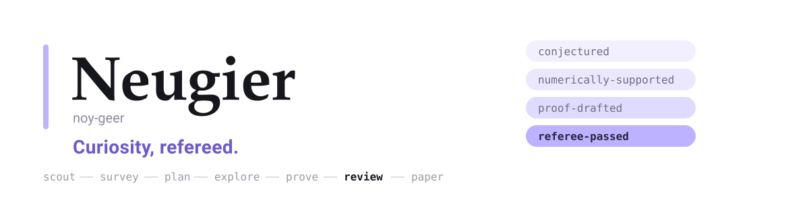

<div align="center">

<picture>
  <source media="(prefers-color-scheme: dark)" srcset="docs/assets/banner-dark.svg">
  
</picture>

<p align="center">
  <a href="https://github.com/zi-wa/Neugier/actions/workflows/tests.yml"></a>
  
  <a href="pyproject.toml"></a>
  
  
  <a href="LICENSE"></a>
</p>

</div>

**Neugier**는 Claude Code 위에서 수학 연구 캠페인을 수행합니다. 문제 풀이기가 아닙니다. 모든 진술은 **주장 원장**에
추측으로 들어오고 증거만이 그것을 승격시키며, LaTeX 논문은 원장이 심사하지 않은 정리를 조판하기를 거부합니다.
심사자는 훅으로 강제되는 정보 차단 뒤 새 컨텍스트에서 일하고, 결함을 심어둔 미끼 라인업으로 채점된 뒤에야
그 판정이 인정됩니다.

[빠른 시작](#빠른-시작) · [구성 방식](#구성-방식) · [기능](docs/features.md) · [무엇이 강제되는가](docs/enforcement.md) · [CLI](docs/cli.md) · [English](README.md)

## 설치

```powershell
git clone https://github.com/zi-wa/Neugier.git; cd Neugier
.\scripts\bootstrap.ps1                       # Linux/macOS: scripts/bootstrap.sh
.venv\Scripts\python.exe -m harness doctor     # 훅, tectonic, UTF-8, 엔진 점검
```

모든 것이 프로젝트 안에 머뭅니다. `.venv`, `bin/tectonic`, `.cache`. 전역 설치도, API 키도, GPU도 필요 없습니다.

## 빠른 시작

```powershell
claude --plugin-dir .
```

```text
/research auto            # 스카우트가 대상을 고르고 캠페인 전체를 수행
/research "sum-free subsets of finite abelian groups"
/status                   # 단계, 미충족 기준, 예산, 질문, 캘리브레이션
```

플러그인으로 설치하려면 `/plugin marketplace add zi-wa/Neugier` 후 `/plugin install neugier@neugier-marketplace`.
무인 실행: `python -m harness headless --slug <slug> --max-iterations 20`.

## 구성 방식

- **주장 원장** — `idea → conjectured → numerically-supported → proof-drafted → referee-passed`. 어떤 단계도 건너뛸 수 없고, `fully_proved`는 선언이 아니라 의존성 그래프에서 계산됩니다.
- **정보 차단** — 심사자는 `statement.md`와 산출물만 봅니다. PreToolUse 훅이 모든 접근을 검사하고 기록합니다.
- **심사자도 심사받는다** — 스켑틱은 진짜 증명·결함을 심은 변이본·대조군이 섞인 라인업을 심사하고, 재현율이 낮으면 발언권이 없습니다.
- **반증 우선** — 증명에 착수하기 전 정리와 모든 보조정리에 반례를 찾고, 반박된 추측은 수리 루프로 들어갑니다.
- **영수증 있는 문헌** — 캠페인 캐시에 받아온 원문에서 그대로 발견된 발췌만 인정됩니다.
- **호기심 엔진** — 정보이득 순으로 정렬된 질문 원장에서 출발하고, 사전 등록한 신뢰도는 사후에 Brier로 채점됩니다.
- **정직한 마무리** — 검증된 결과 등급(`autonomous-new-result`, `partial`, `rediscovery`, `literature-find`, `negative`)과 출처·AI 공개·열린 질문 부록.

심사 강도는 고정이 아닙니다. 주장마다 stakes 0/1/2가 있고 거기서 체제(스켑틱 수, 미끼, 복제자, 인용 홉,
최종 명제 재검색, 사람 서명)가 도출됩니다.

## 문서

| 알고 싶은 것 | 문서 |
|---|---|
| 하네스가 실제로 하는 일과 실행 출력 | [docs/features.md](docs/features.md) |
| 코드가 강제하는 것과 프롬프트일 뿐인 것 | [docs/enforcement.md](docs/enforcement.md) |
| 명령줄에서 다루는 법 | [docs/cli.md](docs/cli.md) |
| 각 메커니즘의 출처 | [docs/research/borrowed-mechanisms.md](docs/research/borrowed-mechanisms.md) |
| 에이전트 규약 | [CLAUDE.md](CLAUDE.md), [skills/references/](skills/references) |

문서는 영어로, 사용자 보고는 한국어로 작성합니다.

## 개발

```powershell
.venv\Scripts\python.exe -m pytest -m "not live"     # 오프라인 테스트 356개
.venv\Scripts\python.exe -m pytest -m live           # 네트워크 테스트 5개
```

모든 파일 입출력은 `encoding="utf-8"`(호스트 기본은 cp949), 훅은 표준 라이브러리만 사용, 배포명은 `neugier-harness`,
콘솔 스크립트는 `neugier`입니다.

## 인용과 라이선스

```bibtex
@software{neugier2026,
  title = {Neugier: an adversarially refereed mathematical research harness},
  author = {zi-wa}, year = {2026}, version = {0.2.0},
  url = {https://github.com/zi-wa/Neugier}
}
```

MIT — [LICENSE](LICENSE) 참조. Claude Code 위에서 동작하는 독립 프로젝트이며 Anthropic과 제휴하거나 후원받지 않습니다.
