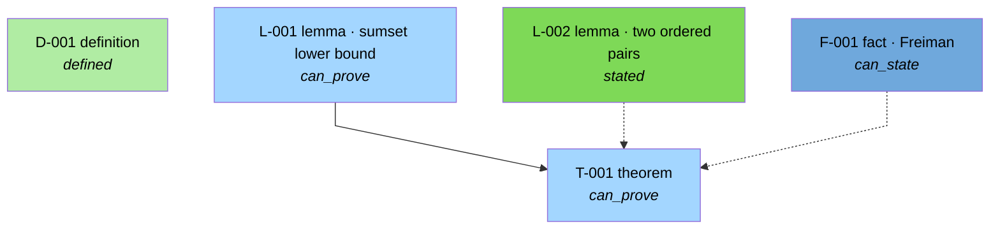

# What Neugier does

Seven mechanisms carry the design. Every console block below is real output, produced by the test fixture
`tests/fixtures/planted/` — a campaign that deliberately contains a circular lemma, a false lemma, an unused hypothesis
and a citation whose excerpt is not in the source.

## Why this exists

In a published audit of an AI system on open Erdős problems, 200 expert-checked answers that the system had *verified
itself* came back 68.5 % flawed, and 50 of the "correct" ones had solved a misread version of the problem
([arXiv:2601.22401](https://arxiv.org/abs/2601.22401)). Separately, an AI's "solutions" to ten Erdős problems turned out
to be literature it had rediscovered. Unchecked self-verification and unchecked novelty are what this harness is built
against.

| The usual failure | What Neugier does about it |
|---|---|
| The model verifies its own proof | Referees run in fresh contexts behind a hook-enforced barrier; every access is logged |
| The reviewer is a rubber stamp | Skeptics are scored on a lineup of decoys; a low-recall verdict is inadmissible |
| A "theorem" rests on an unproved lemma | `fully_proved` is computed from the dependency graph; less than that is a *conditional* theorem |
| Citations from memory | An excerpt must be found verbatim in a source fetched into the campaign cache |
| Numbers invented in prose | Numbers come from scripts into `results.json`; a sampled audit labels sentences |
| "We already knew this" | A novelty gate before proof effort, and a second that re-searches the final statement with its own numbers |
| Confident nonsense | Pre-registered credences on every target, route and proof attempt, scored with Brier |
| The agent quietly gives up | Phase gates refuse to end a phase whose exit criteria are unmet |

## 1 · Curiosity engine

`questions.md` is a ledger: every question has an expectation, a credence, a stake and a cheapest test.
`harness questions next` ranks by expected information gain and warns when the role that raised a question is poorly
calibrated. Predictions are written before experiments, surprises are logged, and each phase carries a 30 % detour
budget an agent may spend without asking. Open questions outlive the campaign and seed the next scout.

## 2 · Evidence-gated ledger, and a paper compiler that obeys it

`ledger add` cannot create anything above `conjectured`; every later status is reached by `promote`, which checks the
evidence. The LaTeX linter binds each theorem to a claim id and refuses what the ledger has not refereed.

```console
$ harness proof check campaigns/demo/proofs/T-001.md --campaign demo
proof check: FAILED  (3 error(s), 0 warning(s))  campaigns\demo\proofs\T-001.md
  [ERROR E_PROOF_CITE] line 20 <cite claim=F-001>: claim status is 'idea', needs known-in-literature
  [ERROR E_PROOF_CITE] line 20 <cite claim=F-001> excerpt-hash 'deadbeef0000' matches no verified excerpt on that claim
  [ERROR E_PROOF_HYPOTHESIS_UNUSED] hypothesis 'S contains 0' is not accounted for in '## Self-check log'
```

## 3 · Enforced information barrier

`reviews/roundN/barrier.json` says what each referee may read; `hooks/barrier.py` checks every Read, Glob, Grep, Bash
and Write of every referee subagent and appends to `access.log`. The replicator must commit its blind re-derivation
before the barrier opens the proof. A round with an unwaived denial fails.

```console
$ python hooks/barrier.py   # PreToolUse payload: skeptic SK-39f152 tries to read ideas.md
[Neugier barrier] Read on 'ideas.md' is not permitted for skeptic:SK-39f152 (deny:ideas.md).
You see only statement.md and the artifact(s) under review; your allowlist: statement.md,
refs.bib, cache/**, ledger.json, ledger.audit.jsonl, experiments/results.json …

$ cat campaigns/demo/reviews/round1/access.log
{"role":"skeptic:SK-39f152","tool":"Read","decision":"allow","target":"statement.md","reason":"allow:statement.md"}
{"role":"skeptic:SK-39f152","tool":"Read","decision":"deny","target":"ideas.md","reason":"deny:ideas.md"}
{"role":"skeptic:SK-39f152","tool":"Bash","decision":"deny","target":"diff reviews/round1/lineup/A.md reviews/round1/lineup/B.md","reason":"deny:shell:pairwise diffs of lineup items are forbidden"}
{"role":"skeptic:SK-39f152","tool":"Read","decision":"deny","target":"reviews/round1/lineup.sealed.json","reason":"deny:reviews/**"}
```

## 4 · Referees are refereed

Opening a round builds a lineup: the real proof, mutants carrying one planted flaw each, and a control proof of a
different statement, all reformatted so items cannot be told apart by diffing. A skeptic's reliability is recall on the
planted flaws, penalized by false alarms on the control; below the threshold its verdict is discarded and a fresh
skeptic is spawned. Promotion needs `k` distinct admissible skeptics, all passing.

```console
$ harness review open --campaign demo --claim T-001 --artifact proofs/T-001.md --seed 7
{
  "deliverables": {
    "skeptic:SK-39f152": "reviews/round1/skeptic.SK-39f152.md",
    "skeptic:SK-6a3357": "reviews/round1/skeptic.SK-6a3357.md",
    "falsifier": "reviews/round1/falsifier.md",
    "novelty":   "reviews/round1/novelty.md",
    "replicator":"reviews/round1/replicator.md",
    "judge":     "reviews/round1/judge.md"
  },
  "lineup": { "dir": "reviews/round1/lineup/", "items": ["A", "B", "C", "D"] }
}
```

The regime is derived from the claim's stakes, so review intensity scales with what is being claimed:

```console
$ harness review regime --campaign demo --claim T-001
{
  "claim": "T-001",
  "regime": { "stakes": 1, "skeptic_passes": 2, "decoys": 2, "control": true,
              "replicator_required": true, "novelty_hops": 1,
              "final_statement_recheck": false, "human_attest": false }
}
```

## 5 · Falsification-first computation

Counterexample search runs before proof effort, on the theorem and on every lemma, in exact arithmetic. Evolutionary
program search needs no API key: cheap subagents propose mutations while the harness rejects near-duplicates, runs
cascade evaluation, collects meta-recommendations and mines elites for structure. Scorers and verifiers are hashed and
frozen; a hook denies edits during explore, prove and review.

```console
$ harness falsify run campaigns/demo/experiments/falsify/L-002.py
{
  "conjecture": "L-002",
  "strategy": "all",
  "tested": 10,
  "counterexample": "S={0, 1, 2}: sum 2 attained by 3 ordered pairs",
  "counterexample_repr": "(0, 1, 2)",
  "seed": 0,
  "regression_set": [],
  "touch_number": null
}
```

A refutation is an input, not an ending: `harness ledger repair` turns the counterexamples into a regression set and
three repair operators, and a child conjecture must pass a truth test and a significance test before it may be promoted.

## 6 · Literature with receipts

No literature claim without a verbatim excerpt that provably occurs in the cached source (exact match, then normalized,
then a chunked fallback for PDF hyphenation). `<cite>` tags in proofs bind to the excerpt hash. The novelty checker
classifies the result 1a/1b/1c/1d, walks citations forward and backward, and — at higher stakes — re-searches the final
statement using the result's own numbers, recording the hash of the artifact it classified.

## 7 · Calibrated curiosity, and metered human attention

Strategists pre-register `p_true` and `p_budget` with a three-persona panel; provers pre-register `p_pass` before each
review round. Brier scores per role accumulate across campaigns in `library/calibration.jsonl`. The human is budgeted
too: three escalations per campaign, each a concrete mathematical question written to `ASK-HUMAN.md` while the campaign
keeps working; answers come back through `HUMAN.md`, a file agents read and never edit.

```console
$ harness campaign status demo
## Phase exit criteria
1 unmet criterion/criteria to leave phase 'review':
- [ ] no referee evidence recorded (no review round found)

## Budgets
- total: 2.741 h spent / 8.0 h
- max_review_rounds: 3; curiosity_fraction: 0.3

## Questions (rule R6)
- questions: open 1; observations: 1; detours: 0
- next: Q-001 Is the bound tight only for arithmetic progressions? (gain 0.300; test: enumerate |S| <= 6 (10 min))

## Human
- escalations: 0/3 used; open: none; policy: MODIFIED
- advisory: L-001 is proof-drafted but no falsification evidence is attached
```

## The blueprint

`harness ledger graph --format mermaid` renders the ledger with
[leanblueprint](https://github.com/PatrickMassot/leanblueprint) statuses. Nothing in the planted fixture reaches
`fully_proved`, and that is the point:



## What you get from a campaign

`campaigns/<slug>/paper/main.pdf` with only ledger-sanctioned theorems; `ledger.json` with every claim, its evidence and
its credences; `reviews/roundN/` with referee reports, `barrier.json`, `access.log`, lineup scores and coverage; the
reproducibility, provenance, AI-disclosure and open-question appendices; and `library/` — memory that carries into the
next campaign.

## What's inside

| | Count | What it is |
|---|---:|---|
| Agents | 13 | scout · librarian · fetcher · strategist · experimentalist · prover · **skeptic · falsifier · novelty-checker · replicator · judge** · writer · copyeditor |
| Skills | 9 | `/research` `/scout` `/survey` `/plan-research` `/explore` `/prove` `/review` `/paper` `/status` |
| Reference docs | 8 | proof standards · referee checklist · technique pitfalls · creative moves · curiosity · novelty protocol · goldmine rubric · LaTeX style |
| Hooks | 6 | `enforce_venv` · `barrier` · `guard_frozen` · `gate_stop` · `gate_subagent` · `inject_context` |
| Python runtime | 71 modules | ledger, literature cache, exact verifiers, evolutionary search, review machinery, paper compiler, cross-campaign memory |
| Tests | 356 offline | plus 5 live network tests and the planted-flaw fixture |

The three commands that carry the design:

| Command | What it does | Contents |
|---|---|---|
| `/research` | Runs a whole campaign, phase by phase, with the curiosity loop between phases | **Agents:** all 13 · **Hooks:** Stop gate on every phase · **Output:** paper, ledger, appendices, validated outcome class |
| `/review` | One adversarial round, also usable standalone on any proof file | **Agents:** k×skeptic ∥ falsifier ∥ novelty-checker ∥ replicator → judge · **Hooks:** PreToolUse barrier, SubagentStop deliverable gate |
| `/prove` | Sketch-first proving: personas sketch, the falsifier attacks, raters rank, Elo picks who writes the full proof | **Agents:** prover ×n, falsifier, judge (rater mode) |
